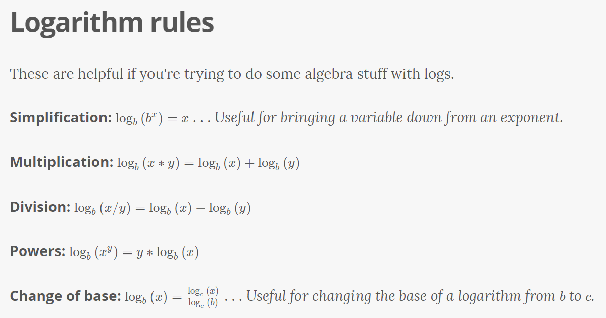
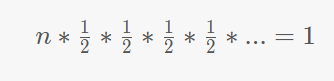
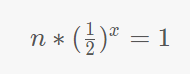
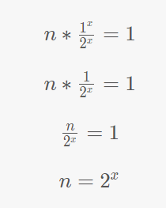
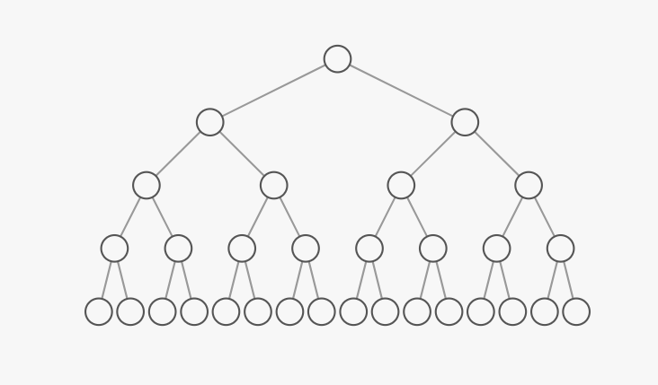
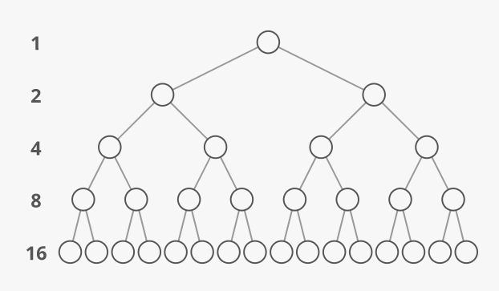
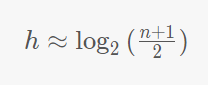
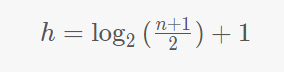

# Logarithm

## Table of Contents
- [What is it?](#what)
- [What are they used for?](#used)
- [Logarithm Rules](#rules)
- [Where do they come up in interviews](#where)
- [Logarithms in binary search (ex. 1)](#ex1)
- [Logarithms in sorting (ex. 2)](#ex2)
- [Logarithms in binary trees (ex. 3)](#ex3)
- [Conventions with bases](#bases)

### <a href="what"></a>What is it?

A logarithm is asking: What power must we raise this base to, in order to get this answer?"

For example, let's look at: log<sub>10</sub><sup>100</sup>

Let's break it down:
  - The _10_ is called the _base_. Makes sense, it's at the bottom.
  - Think of the _100_ as the the _answer_.
  - The logarithm is asking, "What power do we need to raise this base (10) to, to get this answer (100)?"

  10<sup>x</sup> = 100

  What _x_ gets us our result of 100? THe answer is 2:

  10<sup>2</sup> = 100

Final Answer:

log<sub>10</sub><sup>100</sup> = 2


> The "answer" part could be surrounded by parentheses, or not. So we can say log<sub>10</sub><sup>(100)</sup> or log<sub>10</sub><sup>100</sup>. Either one's fine.

### <a hre="used"></a>What are they _used_ for?
THe main thing we use logarithms for is **solving for _x_ when _x_ is an exponent**.

So if we wanted to solve this:

10<sup>_x_</sup> = 100

We need to bring the <sup>_x_</sup> down from the exponent somehow. And logarithms give us a trick for doing that.

We take the log<sub>10</sub> of both sides (we can do this - the two sides of the equation are still equal):

log<sub>10</sub>10<sup>x</sup> = log<sub>10</sub>100

Now the left-hand side is asking, "what power must we raise 10 to in order to get 10<sup>x</sup>?" THe answer, of course, is x. So we simplify that whole left side to just "_x_":

x = log<sub>10</sub>100

We pulled down the _x_ down from the exponent!

Now we just have to evaluate the right side. What power do we have to raise 10 to in order to get 100? The answer is still 2.
x = 2

That's how we use logarithms to pull a variable down from an exponent.

<a hre="rules"></a>



### <a hre="where"></a>Where do logs come up in algorithms and interviews?

"How many times must we double 1 before we get to n?"

"How many times must we divide n in half in order to get back down to 1"

Can you see how those are the same question? We're just going in different directions!
THe answer to both these questions is log<sub>2</sub> n.

It's okay if it's not obvious yet why that's true. We'll derive it with some examples.

### <a href="ex1"></a>Logarithms in binary search (ex. 1)
This comes up in the time cost of **binary search**

This comes up in the time cost of binary search, which is an algorithm for finding a target number in a sorted list. The process goes like this:

1. Start with the middle number: is it bigger or smaller than our target number? Since the list is sorted, this tells us if the target would be in the left half or the right half of our list.
2. We've effectively divided the problem in half. We can "rule out" the whole half of the list that we know doesn't contain the target number.
3. Repeat the same approach (of starting in the middle) on the new half-size problem. Then do it again and again, until we either find the number or "rule out" the whole set.

In code:
```python
def binary_search(target, nums):
    """See if target appears in nums"""
    # We think of floor_index and ceiling_index as "walls" around
    # the possible positions of our target so by -1 below we mean
    # to start our wall "to the left" of the 0th index
    # (we *don't* mean "the last index")
    floor_index = -1
    ceiling_index = len(nums)

    # If there isn't at least 1 index between floor and ceiling,
    # we've run out of guesses and the number must not be present
    while floor_index + 1 < ceiling_index:
        # Find the index ~halfway between the floor and ceiling
        # We use integer division, so we'll never get a "half index"
        distance = ceiling_index - floor_index
        half_distance = distance // 2
        guess_index = floor_index + half_distance

        guess_value = nums[guess_index]
        if guess_value == target:
            return True

        if guess_value > target:
            # Target is to the left, so move ceiling to the left
            ceiling_index = guess_index
        else:
            # Target is to the right, so move floor to the right
            floor_index = guess_index

    return False
```

So what's the time cost of binary search? The only non-constant part of our time cost is the number of times our while loop runs. Each step of our while loop cuts the range (dictated by floor_index and ceiling_index) in half, until our range has jst one element left.
**So the question is, "how many times must we divide our original list size (n) in half until we get down to 1?"**

  

How many 1/2's are there? We don't know yet but we can call that number _x_:

  

Now we solve for _x_:

  

Now to get the _x_ out of that exponent. We'll use the same trick as last time.

Take log<sub>2</sub> of both sides...

log<sub>2</sub> n = log<sub>2</sub> 2<sup>x</sup>

The right hand side asks, "what power must we raise 2 to, to get 2<sup>x</sup>?" Well that's just x.

So there it is. The total time cose of binary search is O(log<sub>2</sub> _n_).

### <a href="ex2"></a>Logarithms in sorting (ex. 2)

Sorting costs O(_n_ log<sub>2</sub> _n_) time in _general_. More specifically, O(_n_ log<sub>2</sub> _n_) is the best worst-case runtime we can get for sorting.
> That's our best runtime for comparison-based sorting. If we can tightly bound the range of possible numbers in our list, we can use a hash map to do it in O(n) time with counting sort.

That's the easiest  way to see why, is to look at merge sort. In merge sort, the idea is to divide the list in half, sort the two halves, and then merge the two sorted halves into one sorted whole. But how do we sort the two halves? Well, we divide them in half, sort them, and merge the sorted halves...and so on.

```python
def merge_sort(list_to_sort):
    # Base case: lists with fewer than 2 elements are sorted
    if len(list_to_sort) < 2:
        return list_to_sort

    # Step 1: divide the list in half
    # We use integer division, so we'll never get a "half index"
    mid_index = len(list_to_sort) // 2
    left  = list_to_sort[:mid_index]
    right = list_to_sort[mid_index:]

    # Step 2: sort each half
    sorted_left  = merge_sort(left)
    sorted_right = merge_sort(right)

    # Step 3: merge the sorted halves
    sorted_list = []
    current_index_left = 0
    current_index_right = 0

    # sortedLeft's first element comes next
    # if it's less than sortedRight's first
    # element or if sortedRight is exhausted
    while len(sorted_list) < len(left) + len(right):
        if ((current_index_left < len(left)) and
                (current_index_right == len(right) or
                 sorted_left[current_index_left] < sorted_right[current_index_right])):
            sorted_list.append(sorted_left[current_index_left])
            current_index_left += 1
        else:
            sorted_list.append(sorted_right[current_index_right])
            current_index_right += 1
    return sorted_list
```

So what's our total time cost? O(_n_ log<sub>2</sub> _n_). The log<sub>2</sub> _n_ comes from the number of times we have to cut _n_ in half to get down to sublists of just 1 element (our base case). The additional _n_ comes from the time cost of merging all _n_ items together each time we merge two sorted sublists.

### <a href="ex3"></a>Logarithms in binary trees (ex. 3)

In a binary tree, each node has two or fewer children.

  

The above tree is perfect because each "level" or "tier" if the tree is full. There aren't any gaps.

One question we might ask is, if there are _n_ nodes in total, what's the tree's _height (h)_? In other words, how many _levels_ does the tree have?

If we count the number of nodes _on each level_, we can notice that it successively _doubles_ as we go:

  

That brings back our refrain, "how many times must we double 1 to get to _n_." But this time, we're not doubling 1 to get to _n_; _n_ is the total number of nodes in the tree. We're doubling 1 until we get to . . . the number of nodes on the last level of the tree.

How many nodes does the last level have? Look back at the diagram above.

The last level has about half of the total number of nodes on the tree. If you add up the number of nodes on all the levels except the last one, you get about the number of nodes on the last level—1 less.

  1 + 2 + 4 + 8 = 151+2+4+8=15

The exact formula for the number of nodes on the last level is: (n+1)/2

> Where does the +1 come from?

>The number of nodes in our perfect binary tree is always odd. We know this because the first level always has 1 node, and the other levels always have an even number of nodes. Adding a bunch of even numbers always gives us an even number, and adding 1 to that result always gives us an odd number.

>Taking half of an odd number gives us a fraction. So if the last level had exactly half of our _n_ nodes, it would have to have a "half-node." But that's not a thing.

> Instead, it has the "rounded up" version of half of our odd _n_ nodes. In other words, it has the exact half of the one-greater-and-thus-even number of nodes n+1. Hence (n+1)<sup>n</sup>/2.

So our height (h) is the same as "the number of times we have to double 1 to get to (n+1)<sup>n</sup>/2." So we can phrase this as a logarithm:

  

One adjustment: Consider a perfect, 2-level tree. There are 2 levels overall, but the "number of times we have to double 1 to get to 2" is just 1. Our height is in fact one more than our number of doublings. So we add 1:

  

We can apply some of our [logarithm rules](#rules) to simplify this:


### <a href="bases"></a>Conventions with bases

Sometimes people don't include a base. In computer science, it's usually implied that the base is 2. So log n generally means log<sub>2</sub> _n_.

> Some folk might want to remember that in most other maths, an unspecified base is implied to be 10. Or sometimes the special constant _e_.

There's a specific notation for log base  that's sometimes used: _lg_. So we could say lg _n_ or _n_ lg _n_ (which comes up a lot in [sorting](#ex2)). Not everyone uses it.

> Some folks might know there's a similar-ish specific notation for log base _e_: ln (pronounced "natural log").

In the big O notation, the base is considered a constant. So folk usually don't include it. People usually say O(log _n_), not O(log<sub>2</sub>n).
But people might still use the special notation lg _n_, as in O(lg n). It saves us from having to write an "o".
