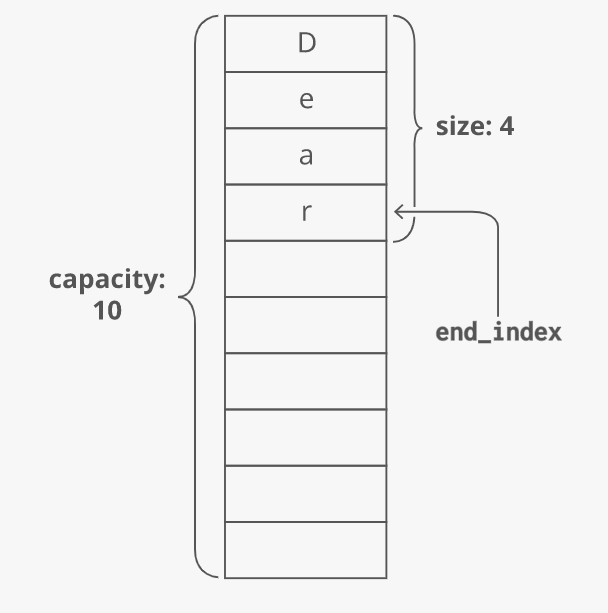
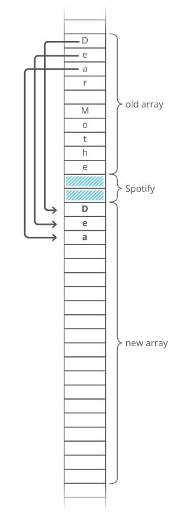

# Dynamic Array

Other names: array list, growable array, resizable array, mutable array

## Quick Reference

A **dynamic array** is an array with a big improvement: automatic resizing.

One limitation of arrays is that they're fixed size, meaning you need to specify the number elements your array will hold ahead of time.

A dynamic array expands as you add more elements. So you don't need to determine the size ahead of time.

### Strengths
  - **Fast lookups**: Just like arrays, retrieving the element at a given index takes O(1) time.
  - **Variable Size**: You can add as many items as you want, and the dynamic array will expand to hold them.
  - **Cache-friendly**: Just like arrays, dynamic arrays place items right next to each other in memory, making efficient use of caches.

### Weaknesses
  - **Slow worst-case appends**: Usually, adding a new element at the end of a dynamic array takes O(n) time.
  - **Costly inserts and deletes**: Just like arrays, elements are stored adjacent to each other. So adding or removing an item in the middle of the array requires "scooting over" other elements, which takes O(n) time.

## In Python 3.8

In Python, dynamic arrays are called _lists_. Here's what they look like:

```Python
gas_prices = []
gas_prices.append(346)
gas_prices.append(360)
gas_prices.append(364)
```

## Size vs. Capacity

When you allocate a dynamic array, your dynamic array implementation makes an _underlying fixed-size array_. The starting size depends on the implementation - let's say our implementation uses 10 dices. Now say we append 4 items to our dynamic array. At this point, our dynamic array has a length of 4. But the _underlying array_ has a length of 10.

We'd say this dynamic array's **size** is 4 and its **capacity** is 10. The dynamic array stores an end_index to keep track of where the dynamic array ends and the extra capacity begins.
  

## Doubling Appends

What if we try to append an item but our array's capacity is already full? To make room, dynamic arrays automatically make a new, bigger underlying array. Usually twice as big.

> Why not just extend the existing array? Because that memory might already be taken by another program.

Each item has to be individually copied into the new array.
  

Copying each item over costs O(n) time! So whenever appending an item to our dynamic array forces us to make a new double-size underlying array, that append takes O(n) time.

That's the worst case. But in the best case (and the _average_ case), appends are just O(1) time.

### Amortized cost of appending

1. The time cost of each special O(n) "doubling appends" doubles each time.
2. At the same time, the _number_ of O(1) _appends_ you get until the _next doubling_ append _also_ doubles.

These two things sort of "cancel out," and we4 can say each append has an average cost or **amortized cost** if O(1).

Given this, in industry we usually wave our hands and say dynamic arrays have a time cost of O(1) for appends, even though strictly speaking that's only true for the _average_ case or the _amortized_ cost.
