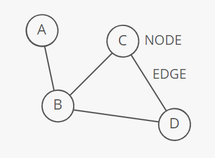
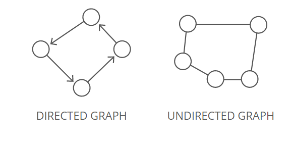
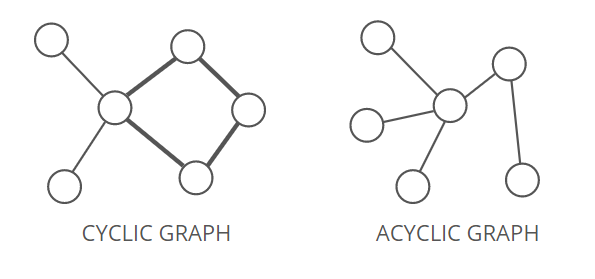
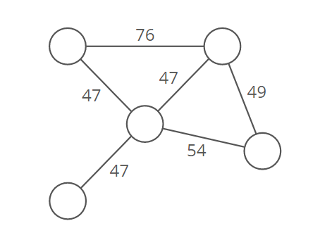

# Graph Data Structure

- [Data Structures: Trees by HackerRank](https://www.youtube.com/watch?v=oSWTXtMglKE)

A **graph** organizes items in an interconnected network. Each item is a **node** (or**vortex**). Nodes are connected by **edges**.

  

**Strengths**
- **Representing links**: Graphs are ideal for cases where you're working with _things that connect to other things_. Nodes and edges could, for example, respectively represent cities and highways, routers and ethernet cables, or Facebook users and their friendships.

**Weaknesses**
- **Scaling challenges**. Most graph algorithms are _O (n * lg(n))_ or even slower. Depending on the size of your graph, running algorithms across your nodes may not be feasible.

## Terminology

### Directed or undirected

In **directed** graphs, edges point from the node at one end to the node at the other end. In **undirected** graphs, the edges simply connect the nodes at each end.

  

### Cyclic or acyclic

A graph is **cyclic** if it has a cycle - an unbroken series of nodes with no repeating nodes or edges that connects back to itself. Graphs without cycles are acyclic.

  

### Weighted or unweighted
If a graph is **weighted**, each edge has a "weight". The weight could, for example, represent the distance between two locations; or the cost or time it takes t travel between the locations.

  

### Legal Coloring
A **graph coloring** is when you assign colors to each node in a graph. A **legal coloring** means no adjacent nodes have the same color:

  

## Representations

There are a few different ways to store graphs. let's take this graph as an example:
