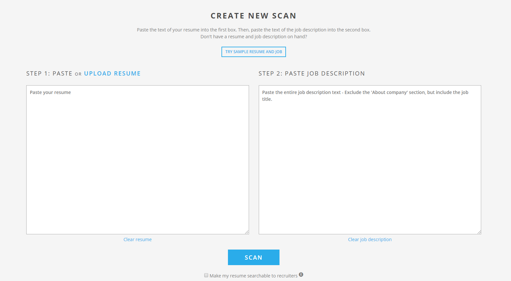
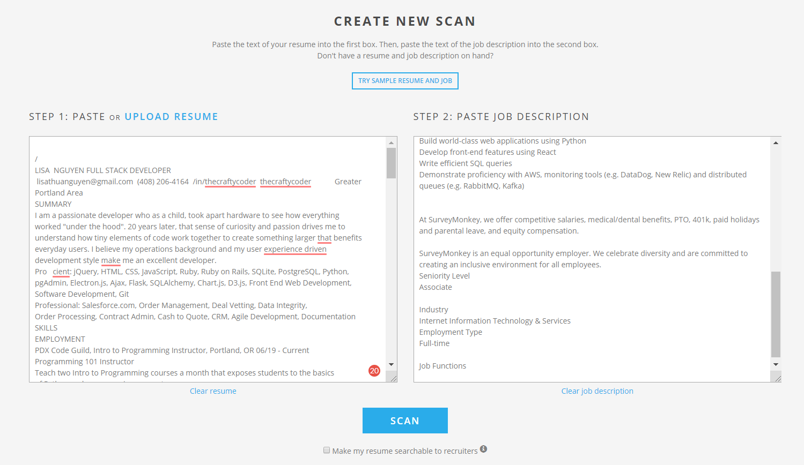
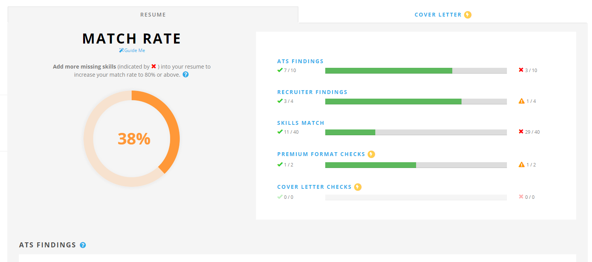
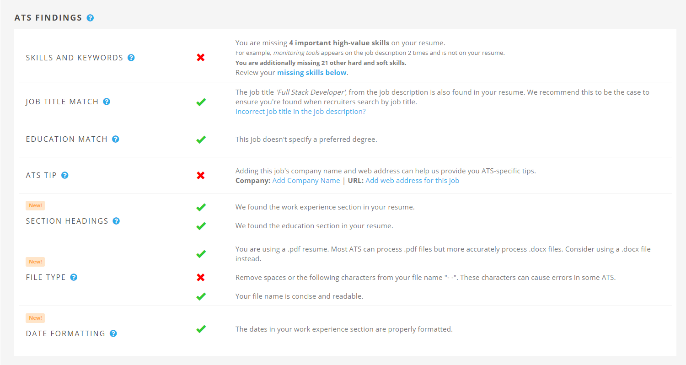
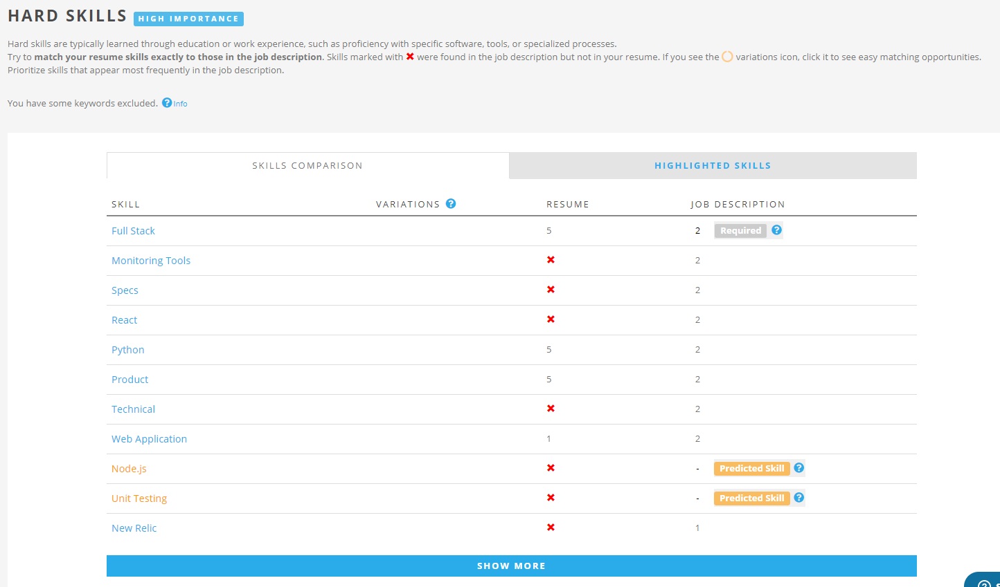
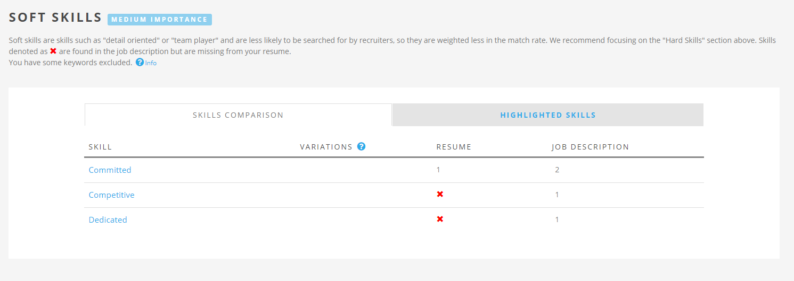
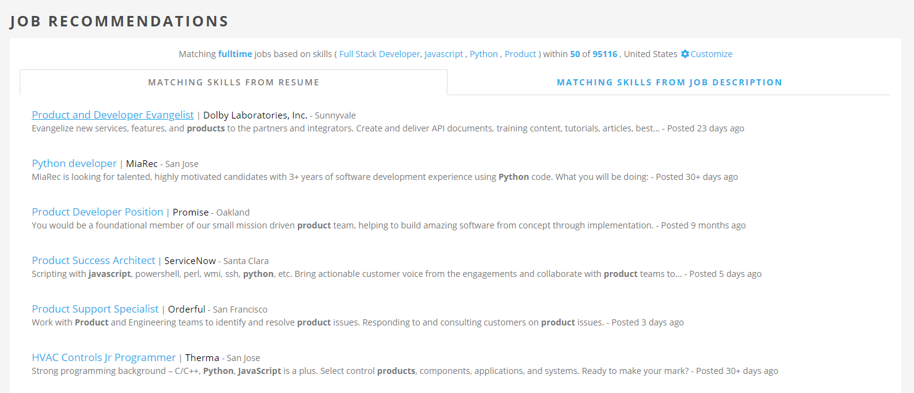

# Jobscan

[Back to Main Page](https://github.com/PdxCodeGuild/career-guide)

Beat the bots! Jobscan provides a comparison tool to determine your match probability to a job.

[Sign up for Jobscan here for 10 free scans.](https://www.jobscan.co/?ref=758524)

## Getting Started

After [signing up for Jobscan](https://www.jobscan.co/?ref=758524), scroll down to the comparison tool and paste/upload your resume.

Then copy and paste the job description. Click **Scan**.

You will then get your **Match Rate**.

Scroll down for more info. Under **ATS Findings**, Jobscan will give you actionable items. Updating this section will increase your match rate.

Another helpful section is **Hard Skills**. Only add suggested skills to your resume **if they are true**.

You might also find the **Soft Skills** section helpful.

Lastly, Jobscan will list job recommendations that match your resume.

Pretty neat, right?