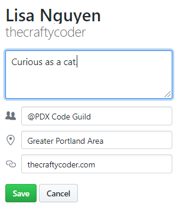
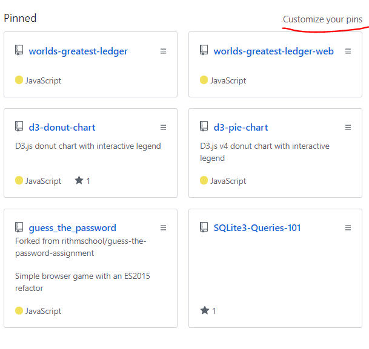

# Github Portfolio
[Back to Main Page](https://github.com/PdxCodeGuild/career-guide)

1. Upload a profile picture or avatar.

    

2. Set status

    Under your profile, click on **Set status** to make a change.

    

3. Update profile details

    

4. Pin your best projects.

    Click on **Customize your pins** and choose your top 6 projects for your portfolio.

    
