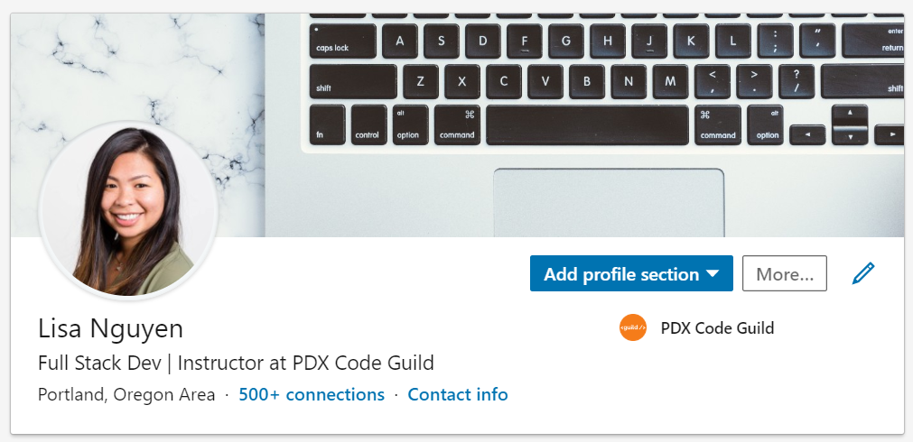
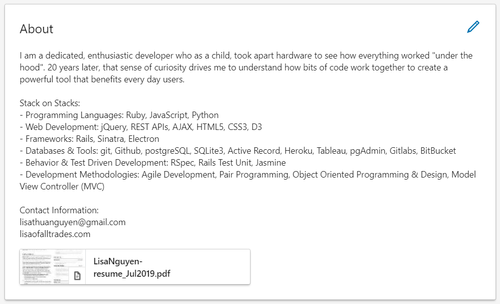
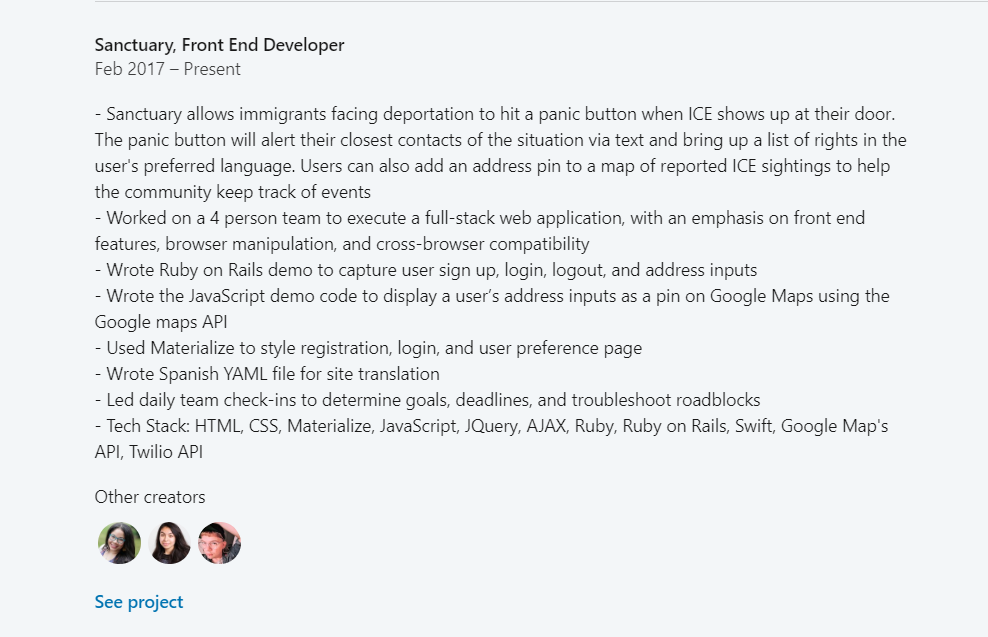
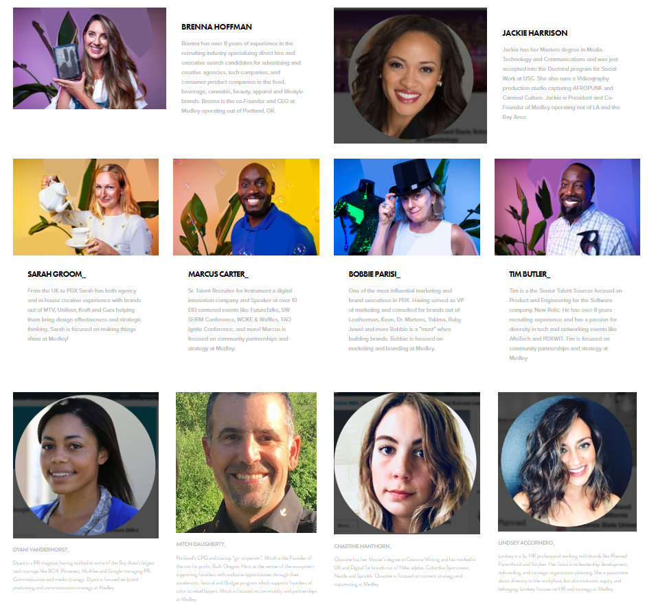

# LinkedIn

- [Back to Main Page](https://github.com/PdxCodeGuild/career-guide)

LinkedIn is the the go-to social media platform for connecting with and building your professional network. Make sure your profile is 100% complete before linking your profile on your resume or in email signatures.

## Info Header

Your info head will be the first thing people see so you want to make a good first impression.

- a professional headshot
  - if you need a headshot, please email our office admin to schedule one: admin@pdxcodeguild.com
- a background image relevant to your profession or hobby
- a title
  - Use highly searched keywords and informative headlines
  - suggestion: this could be the title of roles you're applying to so you'll show up in relevant search results
- shoot for 500 connections

  

## About
- an invigorating summary
  - if you are willing to move, I would add that note here
- summary of skills
- contact info

  

## Media
- This is a good place to attach your resume because it will show up in the **About** section. Please see screenshot above.
- I recommend using the following format when naming your resume file: FirstnameLastname-resume_MMMYYYY.pdf
- If you'd like to kick it up a notch: FirstnameLastname-PositionResume_MMMYYYY.pdf (ex: LisaNguyen-FullStackDevResume_Jul2019.pdf)
- Recruiters see hundreds of resumes a week. Make yours easy to find!
- Attach Portfolio items in your Summary and Experience Sections.

### Front End Developers
- screenshots of your work with a link to the code (github or codepen)

## Experience
- Storytelling - Every statement: Action -> Result -> Significance (why it mattered to the org, team, or client; what did you accomplish)
  - Quantify!
- Emphasize soft Skills
  - leadership
  - taking initiative
  - team player
  - fast learner

## Education
- School: PDX Code Guild
- Field of Study: Full Stack Web Development
- Description: here is an example. You can add more to it if you'd like:
  - _Hands-on 14 week immersive programming bootcamp focusing on Python, Django, HTML, CSS, JavaScript Vue.js, and React.js_
  - Some other details to add: agile, test-driven development, pair-programming

## Licenses & Certificates
- LinkedIn Learning (free with Multnomah Library Card) courses yield certificates. Add them!
- [LinkedIn Learning Library Login](https://www.lynda.com/portal/patron?org=multcolib.org)

## Skills & Endorsements
- Add all the skills!
  - top 3 strongest at the top
- Add your classmates!
- Endorse each other!

## Recommendations
- Write recommendations for classmates, instructors, former co-workers then ask for recommendations in return

## Accomplishments
- Add projects
  - if group projects, add teammates
  - last line of each project should be the tech stack you used

  

- Add awards

## Interests & Groups
- Follow relevant topics and people
- Become a member of at least seven LinkedIn groups and participate in group discussions.

## Change settings so recruiters know you're looking
- Your current employer will not be able to see this.
- Profile > Settings > Job Seeking preferences > Let recruiters know you're open to opportunities > Yes

## Start adding internal recruiters from your dream companies!
- Make sure to include a note! Check out these [templates from the Muse](https://www.themuse.com/advice/want-people-to-accept-your-linkedin-requests-use-these-10-templates).

## Add someone from Medley (Recruiting Agency)

Medley is a strategic recruitment and executive search firm in the diversity and inclusion space who specialize in direct-hire, full-time placements in tech, consumer product, and creative industries.

Check out the [team](https://medleyhire.com/intersectional-team) and add a few of the recruiters on LinkedIn! Make sure you include a personal message!

  

## Engineers from Non-traditional backgrounds
This will be a growing list of LinkedIn profiles of engineers from non-technical backgrounds. Check out their profiles for inspiration! Some will be more filled out than others

### Previous PDX Code Guild Grads
- [Li Poltrak, from carpenter to software engineer](https://www.linkedin.com/in/li-poltorak/)
- [Magdalene Geise, from Bio Labs to QA Engineer](https://www.linkedin.com/in/magdalene-geise-17555b7/)
- [Hekate V. Nichols, from theater to Data Engineer](https://www.linkedin.com/in/katievnichols/)
- [Dana Medhaug, from National Guard to Technical Support](https://www.linkedin.com/in/dmedhaug/)

### More engineers from non-tech backgrounds

#### QA
- [Davis Bare](https://www.linkedin.com/in/davis-bare/)
- [Megan Eding](https://www.linkedin.com/in/meganeding/)

#### Front End
- [Mónica Fidalgo](https://www.linkedin.com/in/monicafidalgo/)
- [Chelsea Dover](https://www.linkedin.com/in/chelsea-dover/)
- [Jennifer Young](https://www.linkedin.com/in/jennifercyoung/)

#### Backend
- [Shawnee Pohlson](https://www.linkedin.com/in/shawneepohlson/)
- [Susie Obrien](https://www.linkedin.com/in/susieobrien7/)

#### Full Stack/SWE
- [Sepand Assadi](https://www.linkedin.com/in/sepandassadi/)
  - Sepand's profile is filled out really well. I actually attended a workshop he led.
- [Jadzia Thomas](https://www.linkedin.com/in/jadziahax/)
- [Lupita Davila](https://www.linkedin.com/in/davilalupita/)
- [Michelle Glauser](https://www.linkedin.com/in/michelleglauser/)

#### Program/Project/Product managers
- [Amber Nash](https://www.linkedin.com/in/ambernash/)
- [Kimberly Embry](https://www.linkedin.com/in/kimberly-embry-53346388/)
