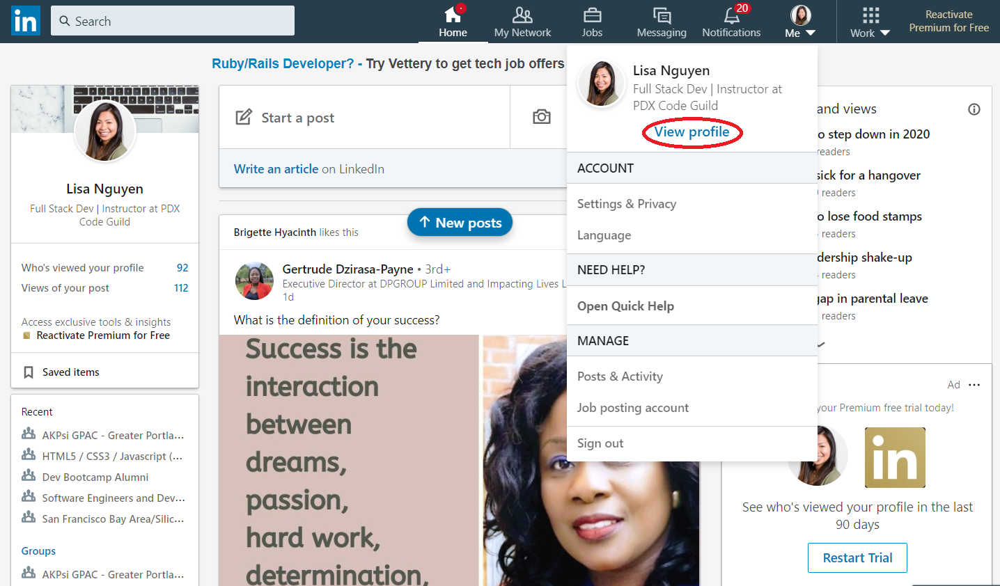
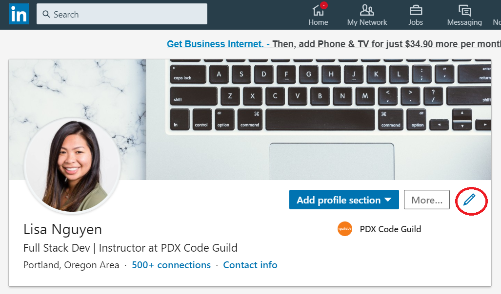
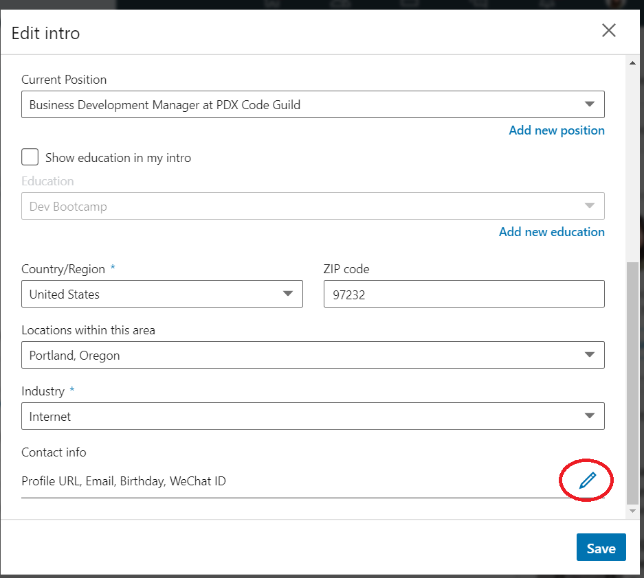
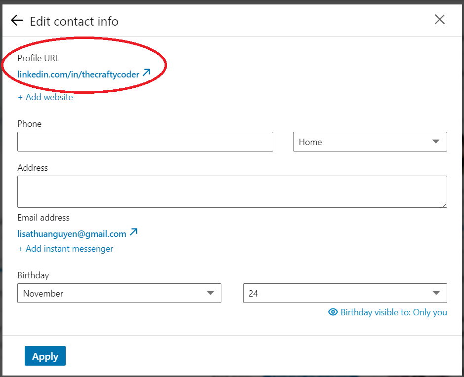
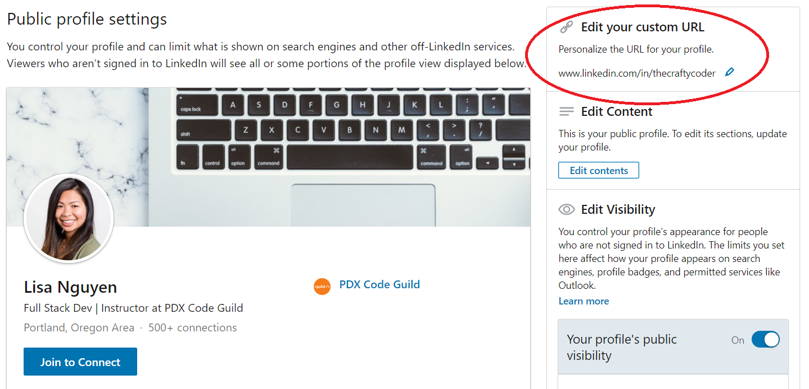
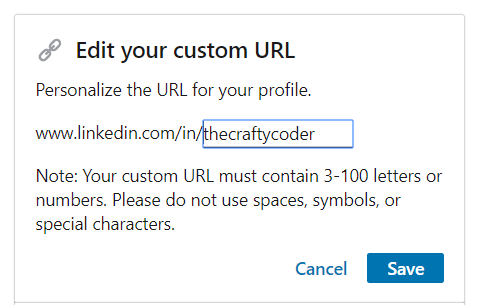

# Vanity URL Instructions
- [Back to LinkedIn Article](https://github.com/PdxCodeGuild/career-guide/blob/master/linkedin/linkedin.md)
- [Back to Main Page](https://github.com/PdxCodeGuild/career-guide)

1. Click on your profile icon and select **View profile**.

  

2. On your Intro header, Click on the **pencil icon** to edit your profile.

  

3. The Edit Intro Box will pop up. Scroll down to the bottom to the **Contact Info** section and click on the **pencil icon** to edit profile URL.

  

4. You'll be taken to edit your contact info. Click on your **Profile URL** to customize it.

  

5. In the right pane, click on the **pencil icon** to edit your profile's custom URL.

  

6. Enter your desired profile URL and click **save**.

    
