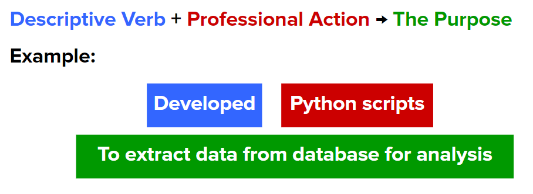
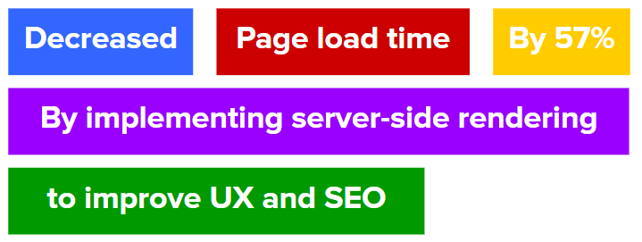

# How to Write Content for Your Resume

[Back to Main Page](/README.md)

Here is a simple format to help you share what you’ve done in the past while being clear and concise.

Other componenets to add in your bullet points are **keywords** & **metrics**.

**Keywords** are words that relate to particular requirements for a job.

**Metrics** are quantifiable measurements that are used to track and evaluate the status of a specific process. (i.e. How successful were you in completing that task?)

Let’s take a look the bullet point with **keywords** and **metrics** added to it.

Note: Not every bullet point will need to have keywords or metrics it’s up to you to determine if that piece information will be valuable to the employer