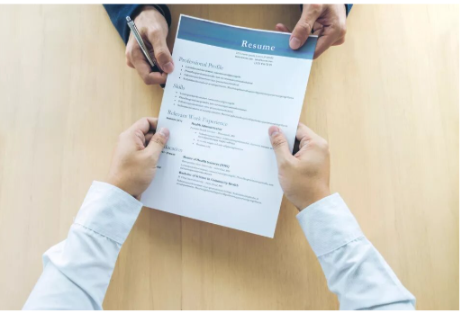
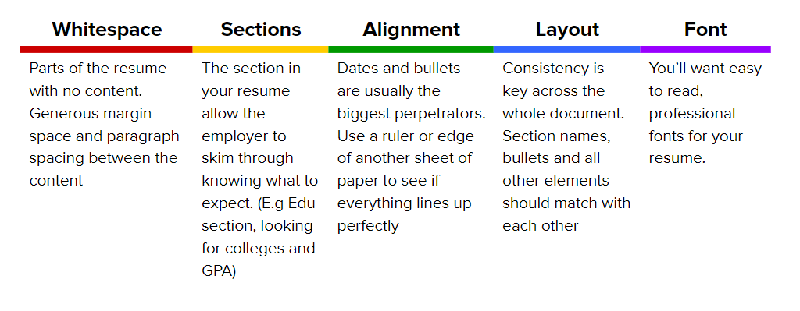

# Resume Formatting

[Back to Main Page](/README.md)

While content in your resume is crucial, your resume also needs to be easy to read and aesthetically pleasing to the recruiter and/or hiring manager. 
The average recruiter and/or hiring manager spends about **7 seconds** reading a resume.

## The essentials

Let’s take a look at 5 key factors when thinking about formatting.

- Whitespace
- Sections
- Alignment
- Design/layout consistency
- Fonts

