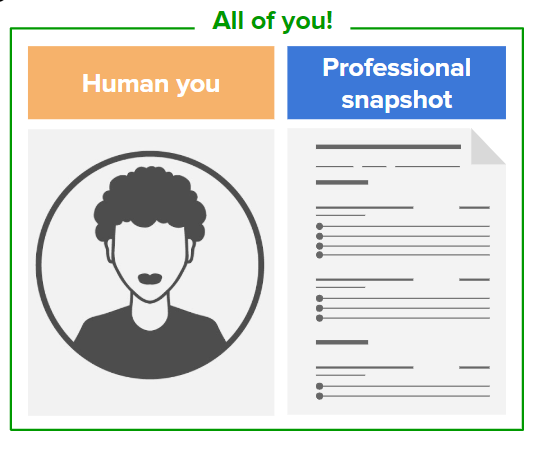

# The Purpose of a Resume

[Back to Main Page](/README.md)

The purpose of a resume is to provide a summary of your skills, abilities and accomplishments. It is a quick advertisement of who you are. 
A "snapshot" of you with the intent of capturing and emphasizing interests but most importantly, to secure you a job interview.

Your resume is usually the first impression the employer gets from you. They review your resume to see:

- where you studied and what you studied
- prior work experience
- industry specific skills/qualifications etc..
- and ultimately, can you do the job they are looking to fill

## A Resume is a One Page Document unless...

Your resume should be one page — unless you have **more than 10 years of experience**.

Learn to **curate** the information you put on your resume, not everything you’ve done in the past should be on your resume.

Think of your resume as an art gallery, you have thousands of sketches but you’ll only display your **best** and **most relevant work** for the exhibition.
